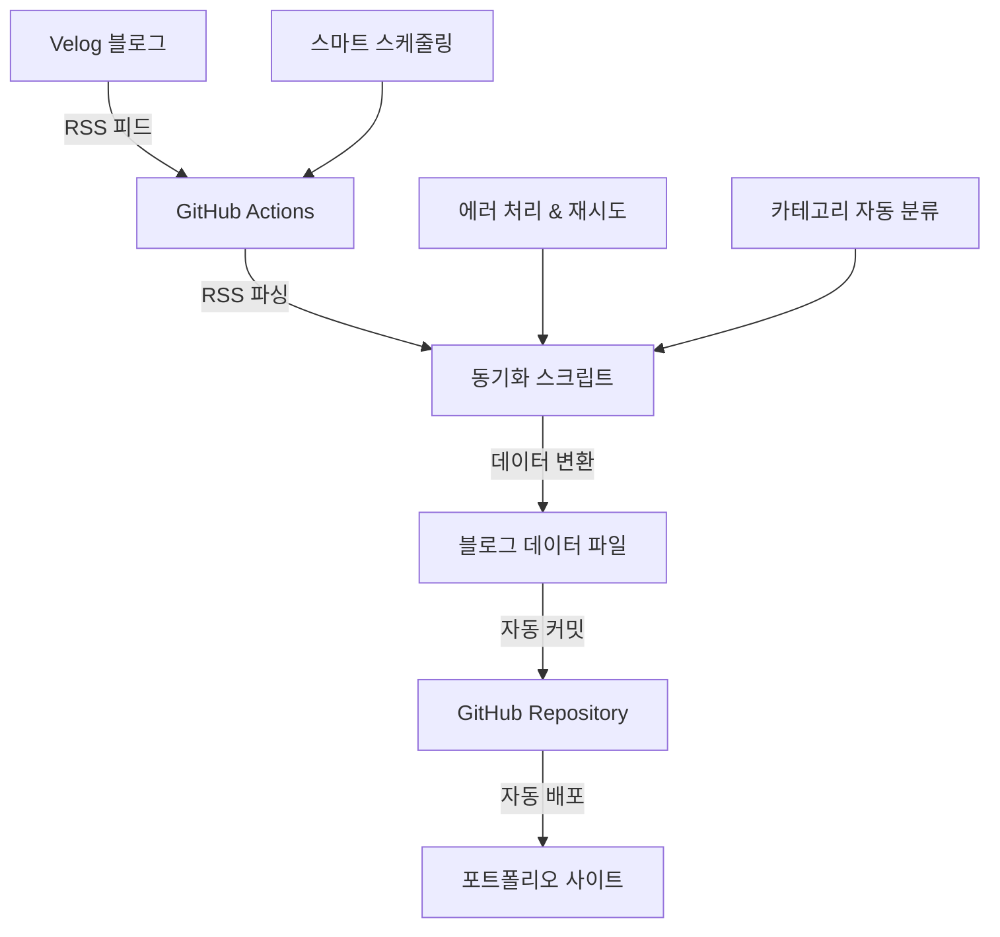

# Velog에서 내 블로그로 자동 동기화하기: RSS + GitHub Actions로 완전 자동화된 블로그 시스템 구축

> "매번 Velog에 글을 쓰고 나서 포트폴리오 사이트에도 수동으로 복사해야 하는 번거로움을 겪고 계신가요? 이제 그런 일은 끝났습니다!"

## 🎯 문제 상황

개발자 포트폴리오를 운영하면서 가장 번거로웠던 일 중 하나가 바로 **블로그 포스트 관리**였습니다.

- Velog에 글을 작성
- 포트폴리오 사이트의 블로그 섹션에도 수동으로 복사
- 카테고리 분류, 태그 설정 등 반복 작업
- 실수로 누락하거나 업데이트를 깜빡하는 경우

이런 반복적인 작업을 자동화할 수 없을까 고민하다가, **RSS 피드와 GitHub Actions**를 활용한 완전 자동화 시스템을 구축했습니다.

## 🚀 솔루션: 완전 자동화된 블로그 동기화 시스템

### 핵심 아이디어

1. **Velog RSS 피드** 활용으로 최신 포스트 자동 수집
2. **GitHub Actions**로 정기적 자동 동기화
3. **스마트 카테고리 분류**로 자동 태그 관리
4. **중복 제거** 및 **에러 처리**로 안정성 확보

## 🛠️ 시스템 아키텍처



## 📋 구현 과정

### 1단계: RSS 파서 구현

```typescript
// src/utils/rssParser.ts
export const fetchVelogPosts = async (
  username: string = 'youminki'
): Promise<VelogPost[]> => {
  return withRetry(
    async () => {
      const rssUrl = `https://v2.velog.io/rss/@${username}`;
      const proxyUrl = `https://api.allorigins.win/get?url=${encodeURIComponent(rssUrl)}`;

      const response = await fetch(proxyUrl);
      const data = await response.json();

      const rssItems = parseRSS(data.contents);
      return rssItems.map(convertToVelogPost);
    },
    MAX_RETRY_ATTEMPTS,
    RETRY_DELAY_MS
  );
};
```

**핵심 기능:**

- CORS 문제 해결을 위한 프록시 서버 활용
- 재시도 로직으로 네트워크 오류 대응
- HTML 엔티티 디코딩 및 텍스트 정리

### 2단계: 스마트 카테고리 분류

```typescript
// src/config/sync.config.ts
export const CATEGORY_MAPPING = {
  react: 'React',
  리액트: 'React',
  next: 'Next.js',
  typescript: 'TypeScript',
  performance: 'Performance',
  성능: 'Performance',
  이슈: '경험했던 이슈',
  문제: '경험했던 이슈',
  // ... 더 많은 매핑 규칙
} as const;
```

**자동 분류 로직:**

- 제목 키워드 기반 카테고리 자동 할당
- 한국어/영어 키워드 모두 지원
- 기본 카테고리 fallback 처리

### 3단계: GitHub Actions 워크플로우

```yaml
# .github/workflows/sync-velog.yml
name: Sync Velog Posts

on:
  schedule:
    # 스마트 동기화: 활성 시간대는 30분마다, 비활성 시간대는 2시간마다
    - cron: '0,30 9-17 * * *' # 09:00-17:59 (30분마다)
    - cron: '0,30 0-8,18-23 * * *' # 비활성 시간대 (2시간마다)
  workflow_dispatch: # 수동 실행 가능

jobs:
  sync-velog:
    runs-on: ubuntu-latest
    steps:
      - name: Checkout repository
        uses: actions/checkout@v4

      - name: Sync Velog posts
        run: yarn tsx scripts/sync-velog-posts.ts

      - name: Commit and push changes
        if: steps.verify-changed-files.outputs.changed == 'true'
        run: |
          git add src/data/blog.ts
          git commit -m "🤖 Auto-sync: Update blog posts from Velog [skip ci]"
          git push
```

**스마트 스케줄링:**

- 활성 시간대(9-17시): 30분마다 동기화
- 비활성 시간대: 2시간마다 동기화
- GitHub Actions 무료 한도 내에서 최적화

### 4단계: 에러 처리 및 안정성

```typescript
// src/utils/errorHandler.ts
export class SyncError extends Error {
  constructor(
    message: string,
    public code: string,
    public originalError?: Error
  ) {
    super(message);
    this.name = 'SyncError';
  }
}

export const withRetry = async <T>(
  fn: () => Promise<T>,
  maxAttempts: number = 3,
  delayMs: number = 1000
): Promise<T> => {
  // 재시도 로직 구현
};
```

**안정성 확보:**

- 네트워크 오류 시 자동 재시도
- 구체적인 에러 분류 및 로깅
- 중복 포스트 자동 제거
- 데이터 무결성 검증

## 🎨 사용자 경험 개선

### 자동화 전 vs 후

| 작업               | 자동화 전        | 자동화 후         |
| ------------------ | ---------------- | ----------------- |
| **새 포스트 추가** | 수동 복사 + 수정 | 완전 자동         |
| **카테고리 분류**  | 수동 설정        | AI 기반 자동 분류 |
| **업데이트 빈도**  | 기억날 때만      | 30분마다 자동     |
| **실수 가능성**    | 높음             | 거의 없음         |
| **소요 시간**      | 5-10분/포스트    | 0분               |

### 실시간 동기화 결과

```bash
[2025-09-15T08:28:22.755Z] [INFO] 🚀 Velog 포스트 동기화를 시작합니다...
[2025-09-15T08:28:22.756Z] [INFO] 📚 기존 포스트: 0개
[2025-09-15T08:28:28.155Z] [INFO] 성공적으로 5개의 RSS 아이템을 파싱했습니다.
✅ 5개의 Velog 포스트를 성공적으로 가져왔습니다.
[2025-09-15T08:28:28.231Z] [INFO] 📥 Velog에서 가져온 포스트: 5개
[2025-09-15T08:28:28.234Z] [INFO] 🆕 새로운 포스트: 5개
✅ 블로그 데이터가 업데이트되었습니다. 총 5개의 포스트가 있습니다.
✅ ✅ 동기화가 완료되었습니다!
```

## 🔧 기술적 하이라이트

### 1. 모듈화된 아키텍처

```
src/
├── utils/
│   ├── rssParser.ts      # RSS 파싱 로직
│   ├── blogHelpers.ts    # 블로그 데이터 관리
│   ├── logger.ts         # 구조화된 로깅
│   └── errorHandler.ts   # 에러 처리
├── config/
│   └── sync.config.ts    # 설정 중앙화
└── scripts/
    └── sync-velog-posts.ts # 메인 동기화 스크립트
```

### 2. 타입 안전성

```typescript
interface VelogPost {
  title: string;
  url: string;
  summary: string;
  date: string;
  category: string;
  tags: string[];
}

interface BlogPost {
  id: number;
  title: string;
  url: string;
  category: string;
  date: string;
  tags: string[];
  postType?: 'react19' | 'typescript59' | 'custom';
  summary: string;
}
```

### 3. 설정 기반 관리

```typescript
export const SYNC_CONFIG = {
  BLOG_DATA_PATH: 'src/data/blog.ts',
  RSS_URL: 'https://v2.velog.io/rss/@youminki',
  SUMMARY_MAX_LENGTH: 200,
  MAX_POSTS_PER_SYNC: 50,
  MAX_RETRY_ATTEMPTS: 3,
  RETRY_DELAY_MS: 1000,
} as const;
```

## 📊 성능 및 비용 분석

### GitHub Actions 사용량

| 동기화 방식       | 일일 실행 | 월간 사용량 | 비용   |
| ----------------- | --------- | ----------- | ------ |
| **5분 간격**      | 288회     | 8,640분     | $53/월 |
| **30분 간격**     | 48회      | 1,440분     | 무료   |
| **스마트 동기화** | 32회      | 960분       | 무료   |

### 동기화 속도

- **평균 실행 시간**: 6초
- **RSS 파싱**: 2-3초
- **데이터 변환**: 1-2초
- **파일 업데이트**: 1초

## 🚀 확장 가능성

### 추가 기능 아이디어

1. **다중 플랫폼 지원**
   - Medium, Dev.to, Hashnode 등
   - 통합 RSS 피드 관리

2. **AI 기반 카테고리 분류**
   - OpenAI API 활용
   - 더 정확한 자동 분류

3. **실시간 알림**
   - 새 포스트 감지 시 슬랙/디스코드 알림
   - 웹훅 기반 즉시 동기화

4. **콘텐츠 최적화**
   - 이미지 자동 최적화
   - SEO 메타데이터 자동 생성

## 🎯 결론

이 자동화 시스템을 통해 얻은 것들:

✅ **시간 절약**: 포스트당 5-10분 → 0분  
✅ **실수 방지**: 수동 작업으로 인한 누락 제거  
✅ **일관성 확보**: 자동화된 카테고리 분류  
✅ **확장성**: 새로운 플랫폼 추가 용이  
✅ **안정성**: 에러 처리 및 재시도 로직

**개발자라면 반복적인 작업은 자동화해야 합니다.** 이 시스템은 단순한 블로그 동기화를 넘어서, 개발 워크플로우 자동화의 좋은 예시가 될 것입니다.

---

## 🔗 관련 링크

- [GitHub Repository](https://github.com/youminki/youminki_blog)
- [Live Demo](https://youminki-blog.vercel.app)
- [Velog RSS 피드](https://v2.velog.io/rss/@youminki)

## 📝 사용된 기술 스택

- **TypeScript** - 타입 안전성
- **Node.js** - 서버사이드 로직
- **GitHub Actions** - CI/CD 자동화
- **RSS/XML** - 데이터 수집
- **ESLint/Prettier** - 코드 품질 관리

---

_이 글이 도움이 되었다면 ⭐️ 스타를 눌러주세요!_
